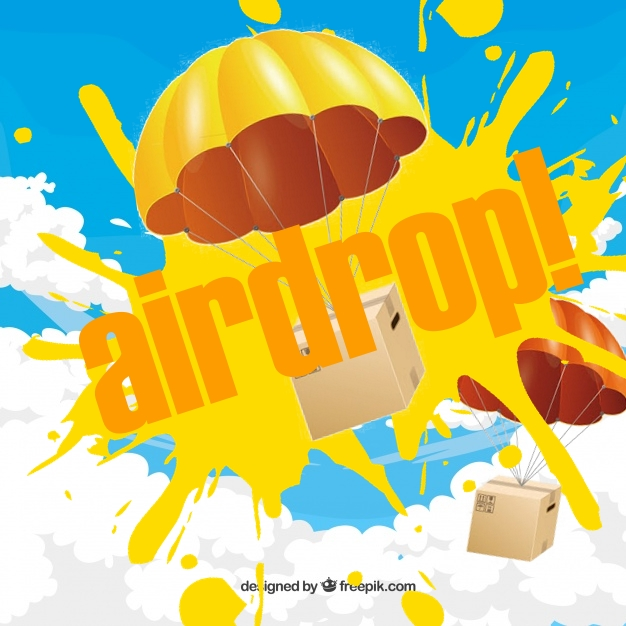

# Airdrop!

###### Temporary logo image of the game

**Airdrop!** is a mobile game by `The Wicked Studio`, the holder of `The Lore of the Worlds` creative project.

It is a hyper-casual game about cargo transportation in danger zones. The concept was inspired by numerous *battle-royale* games where players may get an airdrop.

## Concept
You are the pilot of the airdrop plane. You drop the box in random zone (reaction check - dependency of difficulty level) and then you are controlling the parachute trying to avoid rapid fire from anti aircraft guns. Each X shots  decreases the value of the box. After landing you are opening the box to get coins and exp for other zones (exp) and skins (coins).

Another mode - shooting the airdrop. You are controlling the anti-aircraft gun and trying to shoot the drop. You are getting a tiny amount of coins after each successful shot.

Coin shop: skins for airdrop, for plane and for anti-aircraft

Exp: new locations with different weather and drop zones.

Finishing the game: every location passed (got a diamond rarity box or unlocked by xp wall). Every skin collected

## Fun

You need to avoid missiles shot form anti-aircraft gun to get a better crate. After the crate lands, you will get some reward from the list:

|Reward type|Probability|Amount|
|---|---|---|
|Coins|Guaranteed|(2 + `current zone ratio`) * `difficulty level` * `crate rarity`|
|Experience|Guaranteed|(5 + `current zone ratio` * 2) * `difficulty level` * `crate rarity`|
|Boosters (if any)|5%-15%| 1 * `crate rarity` |
|Extra experience medal|1%-5%|(10 + `current zone ratio`) * `crate rarity`|
|Crate skin|0.5%-2.5%|1-2|
|Plane skin|0.3%-1.5%|1|
|AAG skin|0.2%-1%|1|
|Location skin|0.1%-0.5%|1|

:heavy_exclamation_mark: The numbers are not final.

The probability upgrades with crate rarity. The higher crate you get, the higher probability will be.

You will always get 4 + `difficulty level` rewards.  

The idea is to have fun opening the crates and to deliver the crate accurately to the surface.

## Content updates
Currently there are a lot of ideas for new zones, new skins e.g. for some events, new modes.

## References
* [Project page in Notion](https://www.notion.so/Airdrop-aa61f3d6a9fc4a3aad54c7b5b8931978)
* [Project page in Unity](https://dashboard.unity3d.com/organizations/10170486444766/projects/9ca8cc8f-5cd2-436d-8b74-bb784f4b2ead/settings/general)

If you have any issues with access or any questions, please contact `Artemiy Dobrynin (@StrangerWS)`
